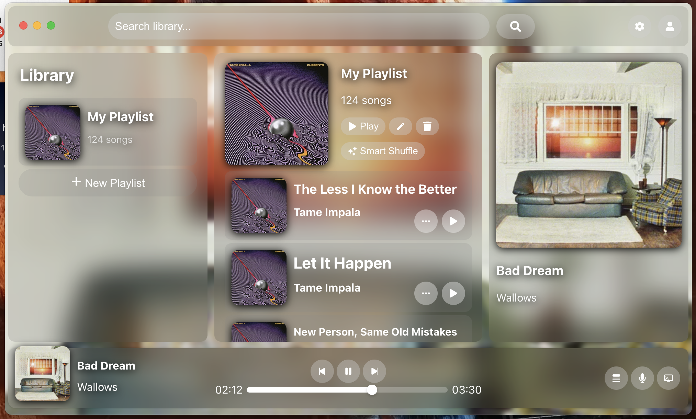

# Ecostream


> A self-hosted Spotify alternative with all the cool features like cross-device control and smart shuffle in one fresh, clean interface.



### Features
- Cross-platform: desktop, Android, and web apps
- Music downloads: search a song. add it to your playlist. done.
- Smart Shuffle: automatically add reccomended songs to your queue. add them to your playlist in one click.
- Offline downloads: listen to music when your server is unreachable or you just don't have access to the internet

### App Install
> Download your respective app file from releases and install it like you would any other app!

### Server Install

1. Clone the repo
    ```bash
    git clone https://github.com/Mang00oo/Ecostream
    ```
2. cd into the server directory
    ```bash
    cd server
    ```
3. Install dependencies
    ```bash
    npm install
    ```
4. Enter your credentials
- Rename the credentials.env.example file to credentials.env
- Enter your password and mongodb URI in PASSWORD and MONGOOSE_URI, respectively
5. Start the server
    ```bash
    node index.js
    ```

### Want to run the web app?
1. cd into the client directory
    ```bash
    cd client
    ```
2. Build the web app
    ```bash
    npm run build
    ```
3. Serve the web app
    ```bash
    npx serve -s build
    ```